# IDEO SF VR Nerd Night in 3 Acts:

## VR Prototyping x 2 + VR Editorial & Effects Pipeline

### Overview

First, [Burton Rast](http://misterburton.com/) will cover a pair of approaches to creating multi-device, web-based, Virtual Reality prototypes via the new WebVR API. Then, [Dav Rauch](http://davrauch.com/) will walk us through his preferred editorial and effects pipeline for crafting VR motion content.

***

### Act I: Prototyping VR with Framer Studio

#### Setup:

1. Download & install Framer Studio [here](http://framerjs.com/download/).
2. Download our sample VR project here [here](http://share.framerjs.com/hjdem7wtcq0n/) by clicking the down arrow in the top right of the page
3. Unzip the downloaded file and drag `ideo-framer-vr-nerd-night.framer` folder to the Framer Studio icon in either your dock or 'Applications' folder
4. Review code comments after each `#` to gain an understanding of the logic:

```
# import the VRComponent
{VRComponent, VRLayer} = require "VRComponent"

# using six images we create the cube map environment
vr = new VRComponent
	front: "images/front.jpg"
	right: "images/right.jpg"
	left: "images/left.jpg"
	back: "images/back.jpg"
	bottom: "images/bottom.jpg"
	top: "images/top.jpg"
	
# on window resize we make sure the vr component fills the entire screen
window.onresize = ->
	vr.size = Screen.size
```

_**Btw, wtf is a 'cube map?'**_

Here's a [video](http://blog.framerjs.com/assets/static/images/vr/cube-full.mp4) that shows how the below image is mapped to a spherical, navigible scene.


#### Add an Icon:

The following code adds our `warning.svg` icon 15° to the right of our starting position and 6° up:

```
icon = new VRLayer
    image:"images/icons/warning.svg"
    heading: 15
    elevation: 6

vr.projectLayer(icon)
```

Detect which way the user is facing by adding the following lines:

```
vr.on Events.OrientationDidChange, (data) ->
    heading = data.heading # capture y axis rotation from 0-360°
    print data.heading # print heading to screen
```

#### Add Interactivity:

Turn on `click` events (off by default) by adding the following code (_note: this turns off click & drag navigation on desktop. Users can, however, navigate with the keyboard's arrow keys. Navigation behavior is not changed on mobile):

```
# enable click events (turns off click & drag to navigate on desktop)
vr.orientationLayer = false
```

Add a HTML text layer at the same heading as our icon (15°) and a slightly lower elevation (1.5°):

```
warningText = new VRLayer
	width: 215
	height: 50
	html: "<p style='font-size:22px; padding: 10px;'>Here's your warning</p>"
	backgroundColor: 'rgba(0, 0, 0, .65)'
	elevation: 1.5
	heading: 15
	
vr.projectLayer(warningText)
```

Add `fadeIn` and `fadeOut` states to affect our `warningText` layer:

```
warningText.states.add
    fadeIn: {
    	opacity: 1
    }
    fadeOut: {
    	opacity: 0
    }
```

Add a `Click` event to our icon to control the `warningText` states:

```
icon.on Events.Click, ->
    if warningText.opacity == 1
    	warningText.states.switch("fadeOut")
    else
    	warningText.states.switch("fadeIn")
```

Finally, make our `warningText` invisible until it is clicked by adding this line to its properties:

```
opacity: 0
```

And comment out our `print.data.heading` line by adding a `#`, like this:

```
# print data.heading
```

>_Note: Framer prototypes can be immediately viewed on your movile device via [Frameless](https://itunes.apple.com/us/app/id933580264) for iOS and [Framer](https://play.google.com/store/apps/details?id=com.framerjs.android) for Android. Simply connect your mobile device and Mac to the same Wi-Fi network. Select your project, and preview your prototype in full-screen._

#### Framer.js References:

* Framer.js Blog: '[Design for Virtual Reality](http://blog.framerjs.com/posts/design-virtual-reality.html)'
* [How to] [Create your own Environment Maps](https://aerotwist.com/tutorials/create-your-own-environment-maps/) (also called 'cube maps')
* [Framer Basics](http://framerjs.com/learn/basics/)
* [CoffeeScript Basics](http://framerjs.com/learn/coffeescript/)

***

### Act II: Crafting VR content via simple, HTML markup via A-Frame by Mozilla

#### Setup:

1. Download Sublime Text 3 Trial [here](http://www.sublimetext.com/3) (or simply use whichever your preferred code editor)
2. Download the project files we'll be workin from [here](https://github.com/misterburton/ideo-sf-vr-nerd-night/blob/master/assets/ideo-aframe-vr-nerd-night.zip?raw=true)
3. Unzip the project files and drag the `ideo-aframe-vr-nerd-night` folder to the Sublime Text icon in either your dock or 'Applications' folder
4. Open your Terminal app by pressing command + space to open Spotlight, then type 'terminal' and press return to launch the app
5. In terminal, type `cd`, followed by a space, and drag & drop the `ideo-aframe-vr-nerd-night` folder into the terminal window. Press `return`
6. Now, type `python -m SimpleHTTPServer` and press `return`
7. Point your browser to `http://localhost:8000` — this is the browser window w/in which you will see our progress as we work

> _Note: all we've done in steps 4-7 is tell Mac OS X to treat the `ideo-aframe-vr-nerd-night` folder as a web server._

In Sublime Text, double-click both the `index.html` and `index-final.html` files in the sidebar. A review of the existing code shows we've added a `meta` tag for iOS home screen apps and imported a pair of JavaScript files:

```
<!DOCTYPE html>
<html>
  <head>

    <meta charset="utf-8">
    <title>IDEO SF Panorama - Lookout</title>

    <!-- hide browser chrome if site is saved to home screen on iOS -->
    <meta name="apple-mobile-web-app-capable" content="yes">

    <script src="js/aframe.js"></script>
    <script src="js/aframe-no-click-look-controls.min.js"></script>

  </head>

  <body>

    

  </body>

</html>

```

#### Create Navigable VR Scene:

Withing the two `body` tags, add the following lines to add our lookout image to the scene:

```
<a-scene>
  <!-- point a-sky element to spherical image -->
  <a-sky src="img/panos/lookout.jpg" rotation="0 0 0"></a-sky>
</a-scene><!-- /.a-scene -->
```

>_Note: all of the markup for our VR scene will exist w/in the 2 `a-scene` tags._

Refresh the page at `http://localhost:8000/` — this is your `index.html` page — and click & drag to pan around the scene.

#### Improving the Navigation:

While VR created with A-frame is navigated on mobile by simply moving your device to 'look' around the scene, desktop browsers require that you click & drag to navigate. To create a more analogous user experience, we're going to implement the more intuitive 'no click look controls' from [Alex Kass](https://github.com/alexrkass/aframe-no-click-look-controls).

Paste the following code beneath our `<a-sky…` line to add these controls and a cursor:

```
<!-- camera & cursor -->
<a-entity camera no-click-look-controls="maxyaw:3.5; maxpitch:1.5">

  <a-entity cursor="fuse: true; maxDistance: 30; timeout: 1000"
            geometry="primitive: ring"
            position="0 0 -1"
            scale=".035 .035 .035"
            material="color: white; shader: flat">
  </a-entity>

</a-entity><!-- /.camera & cursor -->
```

Refresh your browser to see how our navigation has changed.

Re: fuse based cursors, from the A-frame docs:

>If the cursor is set to be fuse-based, the cursor will trigger a click if the user gazes at one entity for a set amount of time. Imagine a laser strapped to the user’s head, and the laser extends out into the scene. After the timeout, whatever entity the laser intersects first will be clicked.

Having two cursors visible — both the ring that denotes what the user is looking at, and the traditional cursor — is a confusing user experience. With this in mind, paste the following lines after the `<title>` tag to hide the mouse:

```
<style>
  body {
    cursor: none;
  }
</style>
```

#### Add Interactivity:

All we've yet to add, visually, is a means to navigate to another area of IDEO SF. Add the following just _above_ the closing `</a-scene>` tag:

```
<!-- front desk sign -->
<a-entity id="front-desk"
          position="10 1.4 -4"
          rotation="0 -75 0"
          geometry="primitive: plane; height: 1; width: 3.48;"
          material="src: url(img/icons/front-desk.png) opacity: .5; transparent: true;">
</a-entity><!-- /.front desk sign -->
``` 

Now, all that remains is a few lines of Javascript to navigate to our `front-desk.html` file on click. Add the following code just above the closing `</body>` tag:

```
<script>

  document.querySelector('#front-desk').addEventListener('click', function () {
    console.log('click front desk');
    location.assign("front-desk.html");
  });

  document.querySelector('#front-desk').addEventListener('mouseleave', function () {
    console.log('leave front desk');
  });

</script>
```

That's it! I've already written the markup & JavaScript for the `front-desk.html` file so that you can navigate back & forth between rooms. The code for both pages is effectively identical, so it's easy to see how quickly a number of VR scenes would be to create. With this in mind, there are a number of other spherical captures in the `img > panos` folder, should you wish to create and navigate to more rooms.

If you open Chrome's console `View > Developer > Javascript Console` or `⌥⌘J`, you'll see our `click` and `mouseleave` events firing as you roll over & off the signs.

#### Bonus Points:

For a better user experience for your VR prototypes on iOS, you can upload them to the web and save the page to the home screen of your phone to view them fullscreen, with no browser chrome (this effect is achieved via the `<meta>` tag toward the top of our pages). However, clicking links to other web pages in home screen web apps launches Mobile Safari to open the new page.

This is, of course, a terrible user experience. To resolve this and ensure that the pages are instead opened in your home screen web app, add the following JavaScript just before the closing `</script>` tag:

```
// open new pages in home screen web app on iOS, not in mobile safari
(function(a,b,c){if(c in b&&b[c]){var d,e=a.location,f=/^(a|html)$/i;a.addEvent Listener("click",function(a){d=a.target;while(!f.test(d.nodeName))d=d.parentNode;"href"in d&&(d.href.indexOf("http")||~d.href.indexOf(e.host))&&(a.preventDefault(),e.href=d.href)},!1)}})(document,window.navigator,"standalone")
```

#### A-frame References:

* [Mozilla A-Frame Site](https://aframe.io/) (Examples, Docs, Blog)
* [A-Frame on Github](https://github.com/aframevr/aframe/)
* [Made with A-Frame Tumblr](http://aframevr.tumblr.com/)
* [A-Frame Slack](https://aframevr-slack.herokuapp.com/)
* [WebVR Slack](https://webvr-slack.herokuapp.com/)
* [WebVR on Reddit](https://www.reddit.com/r/webvr)
* [No click look controls by Alex Kass](https://github.com/alexrkass/aframe-no-click-look-controls)

***

### Act III: VR Editorial & Effects Pipeline w/ Dav Rauch

#### Overview

This tutorial is intended to guide you through the basics of:

1. **Acquision** of photographic spherical content (in this case using the Ricoh Theta S camera)
2. **Editorial** (in Premiere)
3. **Effects/Titling/Color** (in After Effects)
4. **Output** (via media encoder), and finally
5. **Preparation** (metatagging) for online distribution which is discussed in Burton’s above tutorial

_Note: this tutorial is written for Mac OS X._

#### Ricoh Pipeline

> Excerpts from [eleVR: The Complete Theta Tutorial](http://elevr.com/the-complete-theta-tutorial/)

Capture as per manufacturer’s suggestions. transfer onto computer and convert to equirectangular footage.

##### Software

Download the [SphericalViewer.app](https://theta360.com/intl/support/download/pcapp/macosx) from [Ricoh Downloads](https://theta360.com/en/support/download/)

If you see the below error:

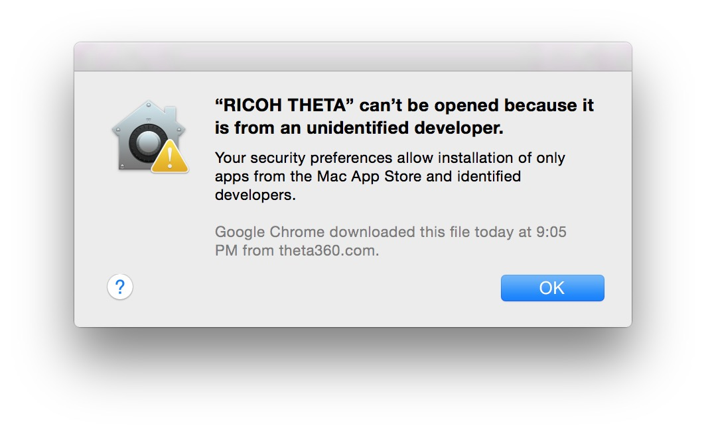

Open Mac OS X `System Preferences > Security > General` and make sure your settings allow you to run this app: 

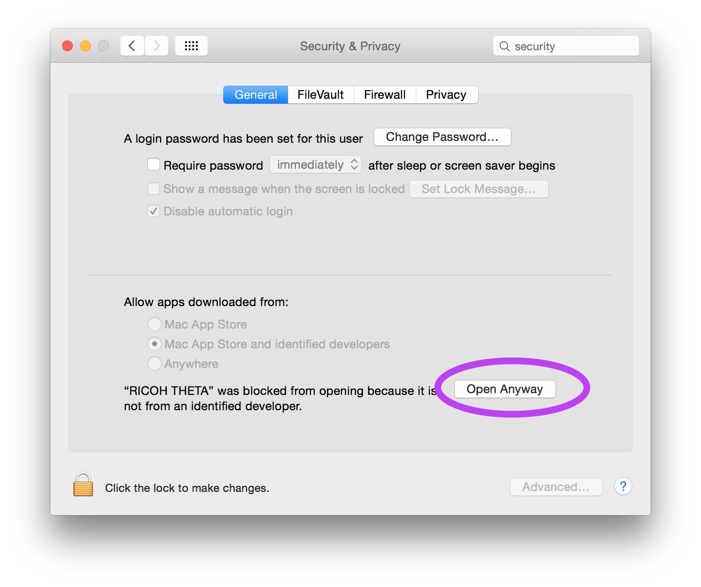

Next, if you’re using the current version of Adobe Air (which is very likely),  you’ll need to **uninstall Adobe Air and install an older version of it** (at least for now -- hopefully we can delete this step soon). you’ll know if you need to downgrade Adobe Air because you’ll get a bug in the Ricoh app which will prevent you from converting.

**Now, finally, stitch footage into equirectangular format from raw source.**

From this:

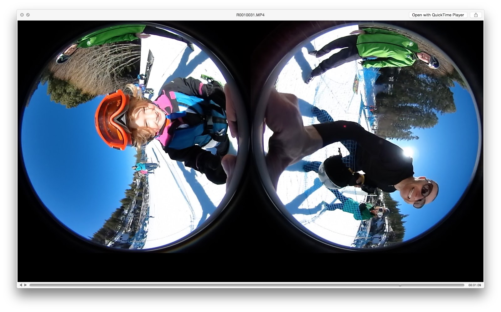

To this:

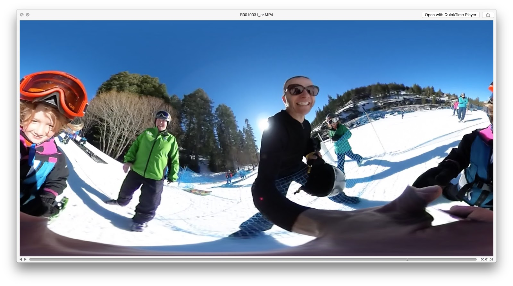

Use the Ricoh Theta app to convert to equirectangular format (can batch process).

If you see “decompressing video” with spinning circles, your app hasn’t crashed, it’s just that you don't see the dialog box. to find it, simply click anywhere on the Ricoh Theta App window and it should pop in front. 

It should look like this with dialog box in front: 

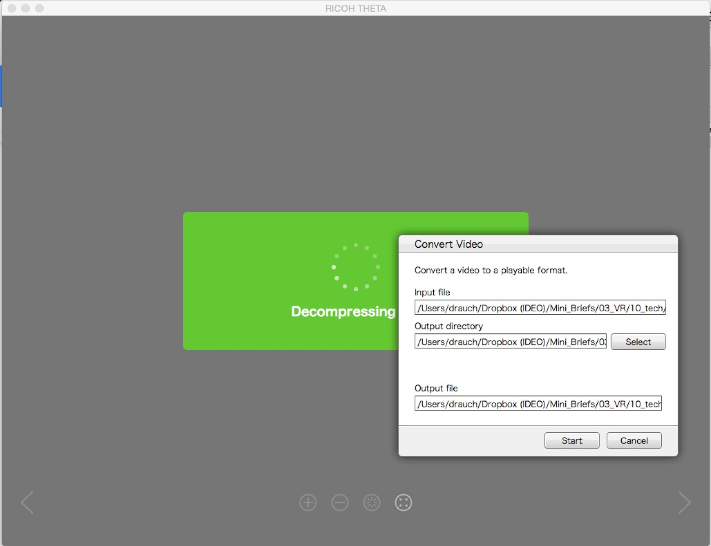

Drag multiple or open multiple to batch convert, select output folder and hit “start:”

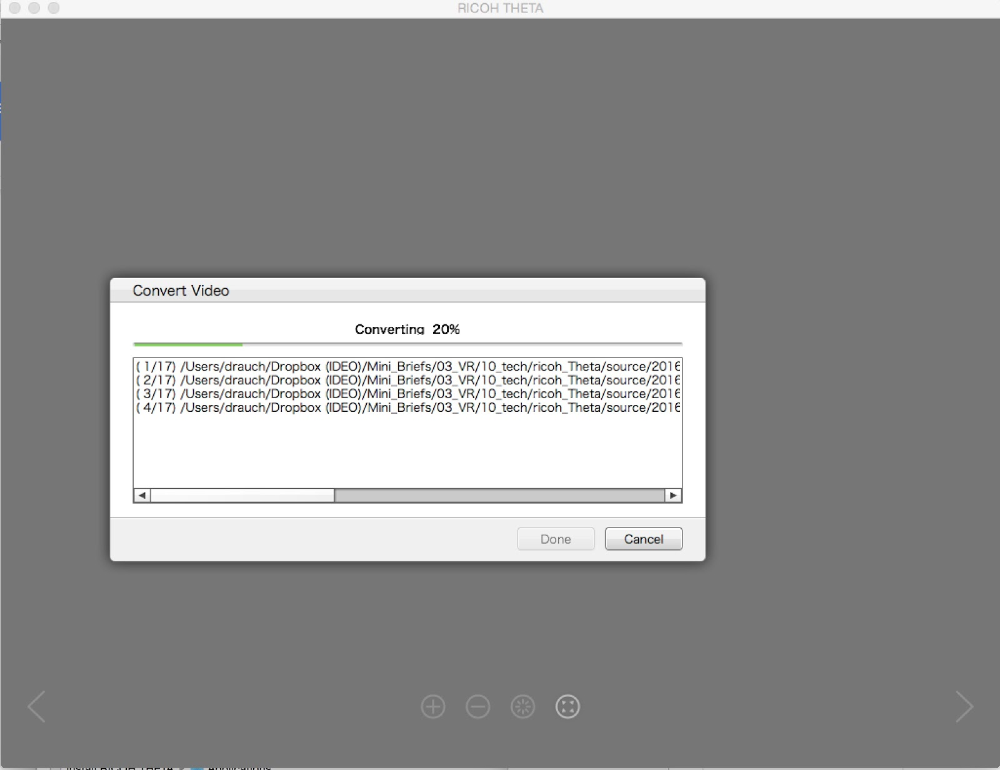

It would be nice if it was possible to convert to equirectangular and output using a lossless codec. But at this point we lose a generation. Bummer. I’ll complain to Ricoh. But perhaps there’s another way to convert using another tool? Not sure how much actual stitching is happening (which is computationally intense) and how much it’s just merging the footage, in which case there should be other ways to do it. 

For good hygiene, I separate the newly generated footage at each step. This is because, through this process, you will generate a whopping FIVE versions of each clip that finds its way all the way through the pipeline! so here’s what my source folder looks like:

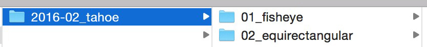

#### Editorial Pipeline (Ricoh to Premiere)

Edit as you typically would in Premiere.

Drag equirectangular footage from bin onto the `New Sequence From Footage` icon in order to create new sequence with settings that match footage:

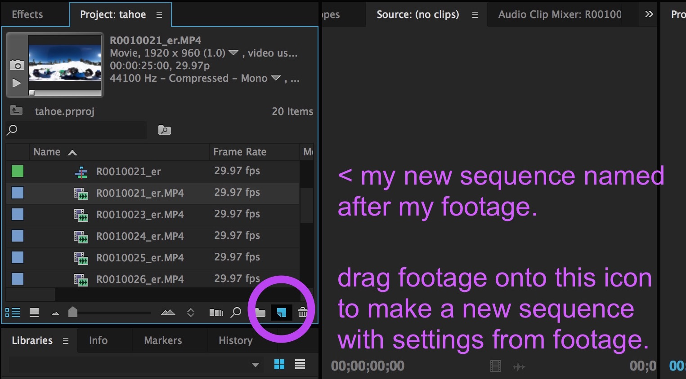

You can organize your edited footage for export to After Effects by adding descriptions to you sequence naming convention. (just a suggestion)

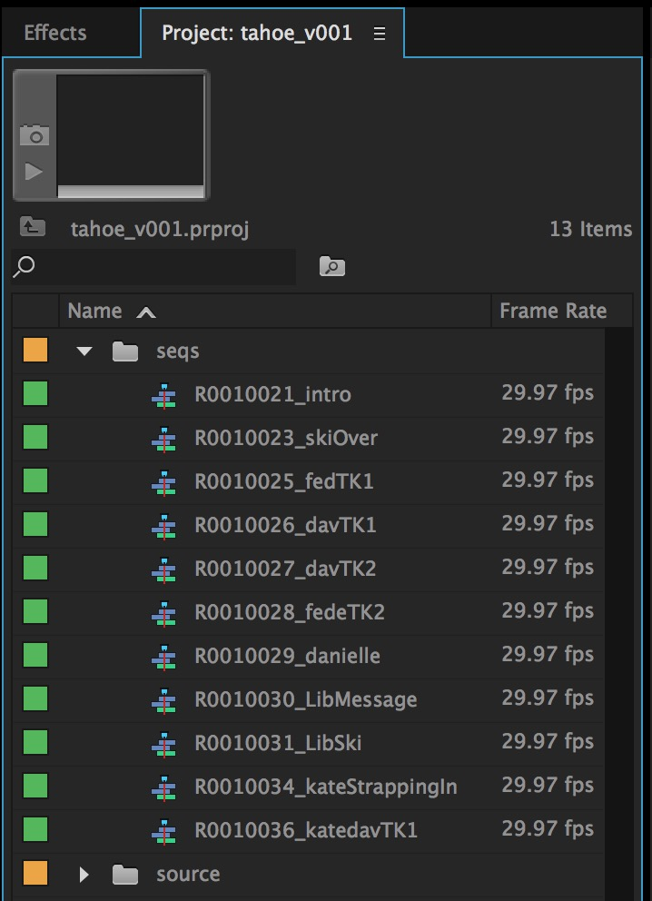

#### Effects & Titling Pipeline (Premiere to After Effects)

##### Software & Resources

* [SkyBox Studio](http://www.mettle.com/product/skybox-studio/) by [Mettle](http://www.mettle.com/) - SkyBox Studio is a bundle of scripts + plugins which create a workflow in After Effects and Premiere for working with spherical video. (it RULES). Here’s an [article](https://www.rocketstock.com/blog/creating-360-video-effects/) about it.
* A 3rd party [YouTube tutorial](https://www.youtube.com/watch?v=pxNTFMtkxWU) on SkyBox
and the very useful Mettle’s SkyBox tutorials
* And the very useful [Mettle’s SkyBox tutorials](http://www.mettle.com/skybox-tutorials/)

Import premiere trimmed sequences into after effects and create comp, just like in Premiere.

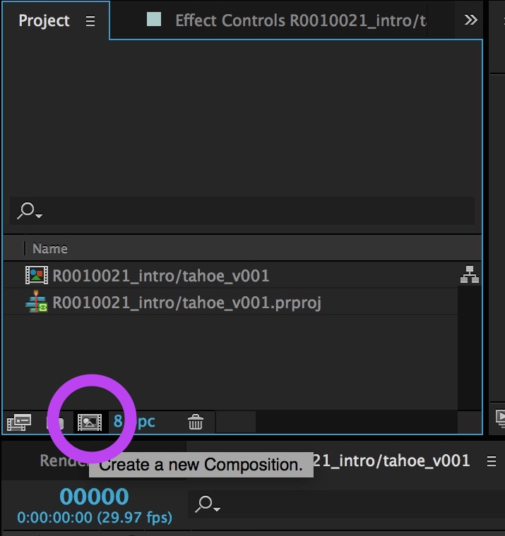

Precompose source for good hygiene:

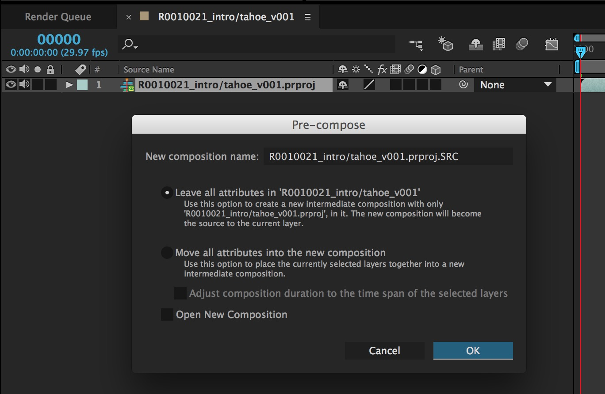

Rename + reorganize:

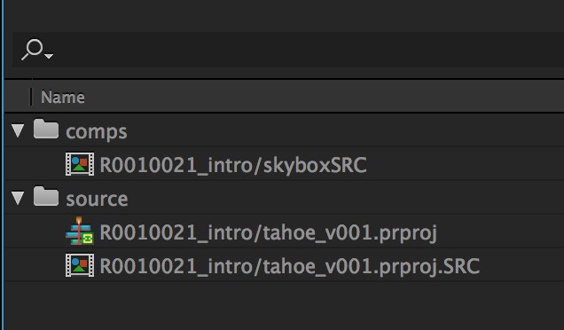

With source layer selected, run script SkyBox Extractor:

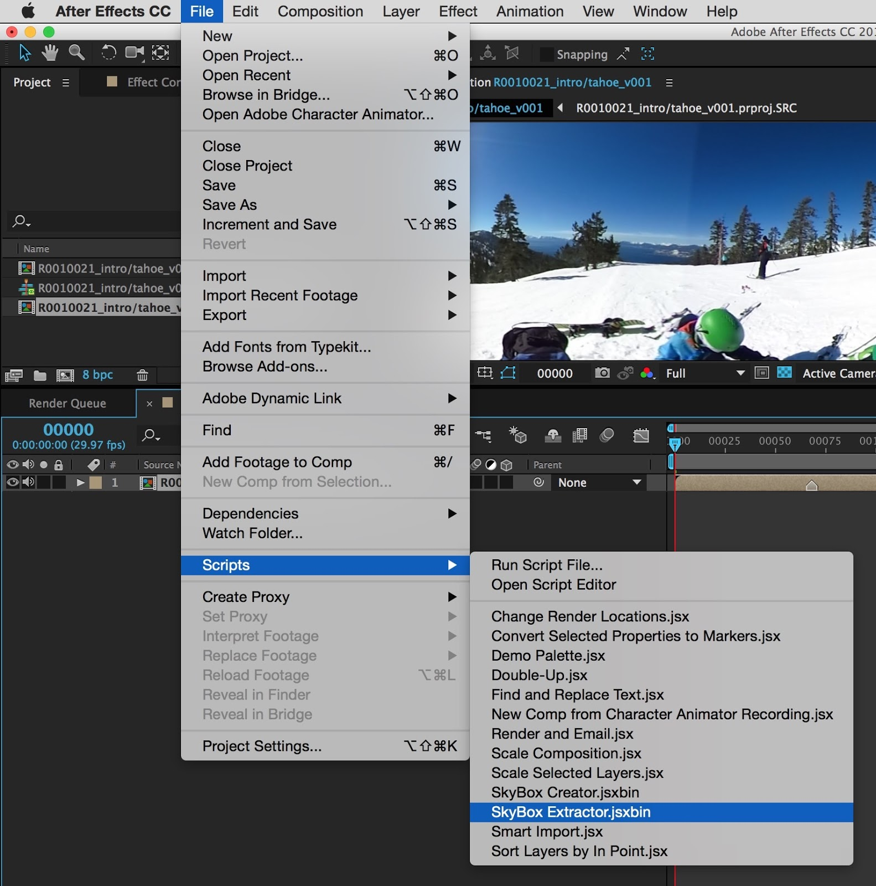

Uncheck if not using 3D plugins (it simplifies things):

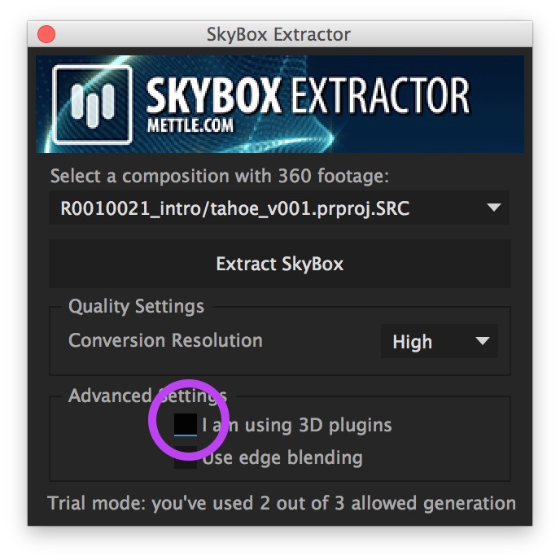

From here on out, you’ll do much better to follow the excellent [Mettle’s tutorials](http://www.mettle.com/skybox-tutorials/) from the Mettle site than to have me try to recreate them here. But suffice it to say that SkyBox will automatically create bunch of appropriately named comps which will allow you to edit, preview and output (see image below) your spherical video in a 3D environment that makes sense allowing you to do the kinds of things you like to do in after effects without twisting your brain around the crazy distortion inherent in the equirectangular format -- it takes care of the mindbending distortion for ya.

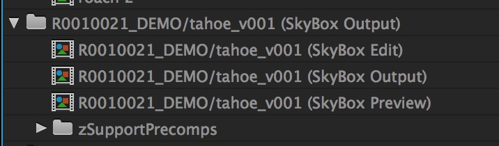

#### Output Pipeline

##### Output your High Res Master Files

when you’re ready to output your footage for distribution, i would suggest outputting from Premiere or AE as close to a lossless pipeline as possible so that you have a lossless master, compressing to your desired format as a last step (or, almost last step). i would recommend proRes 422 or 444 as an super efficient and high quality compressor. 

##### Compress Masters for Playback Device

Once you’ve got your high res master files, then compress from Adobe Media Encoder using H264 preset with `match settings` selected. At this point your file **MUST** be in .MP4 format!

I suggest keeping track of 3 versions of the same clips that you’ll generate by putting them into different folders, with a clear and simple and consisten naming convention like this:

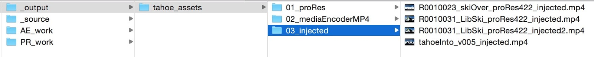

Inject Spherical Metadata into your Compressed Files

Finally, you’ll need to “inject” some simple metadata into your spherical video so that sites such as YouTube360 and Facebook recognize this footage as spherical and play it back appropriately (looking like you’re inside the sphere instead of looking at flat equirectangular footage). This is a fast and easy process. 

Download [360 Video Metadata Tool](https://github.com/google/spatial-media/releases/download/v2.0/360.Video.Metadata.Tool.mac.zip) from the [Upload 360 degree videos page](https://support.google.com/youtube/answer/6178631?hl=en) 
open file, check `spherical` box:

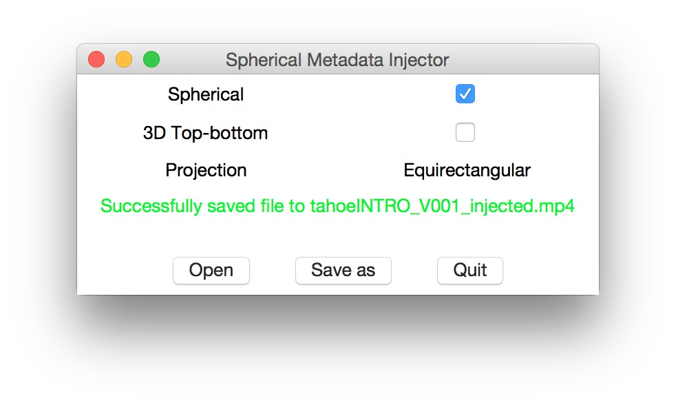

Save.

Now you’re ready to post on YouTube360!

##### YouTube Metadata + Upload Instructions

[Upload 360 degree videos into YouTube](https://support.google.com/youtube/answer/6178631?hl=en)

Or … upload to your online server and rock some of Burton’s code to host your new sherical experience from your own site! 

***

## Putting it all together

Interactive, A-frame VR Scene with spherical video using [no-click-look-controls](https://github.com/alexrkass/aframe-no-click-look-controls) and [play button video fix](https://github.com/gtk2k/gtk2k.github.io/tree/master/aframe_videosphere) for iOS (Be sure to add to home screen on iOS for the video to work as expected):

[http://client.ideo.com/nerdnightvr/](http://client.ideo.com/nerdnightvr/)

>_Note: All of the code in this example is compiled from the above-linked, open source libraries and the A-frame [documentation](https://aframe.io/docs/guide/)._


***

## Might I suggest …

Most all of us learn best both by doing/making and by repetition. Head North to IDEO Production, rent out our new Ricoh spherical camera, snap some pics & video, follow Dav's above process to edit & title them and finally, use them in an A-frame or Framer VR prototype that you create.

## Also Worth noting

As Dav's presence and shared expertise shows, Nerd Night is not at all about me. Rather, it's about our community of minds being more deliberate about sharing what we know, particularly when it comes to new technologies & methodologies we're excited about; those that help us all to become better designers and to do new & interesting project work.

I've already spoken with Paulo and Mel about hosting a Nerd Night workshop on Facebook's excellent [React](https://facebook.github.io/react/) framework. React comes in two flavors, original and [React Native](https://facebook.github.io/react-native/). The latter technology allows anyone w/ web dev chops to write native iOS & Android apps using JavaScript (the layout of React Native apps is even done in Flexbox).

If you have or happen upon something you'd like to share, let me know. A few of us have spoken about making this a monthly get-together, which means a dozen new opportunities each year that we become a crew of even badder already bad m'f'ers.

