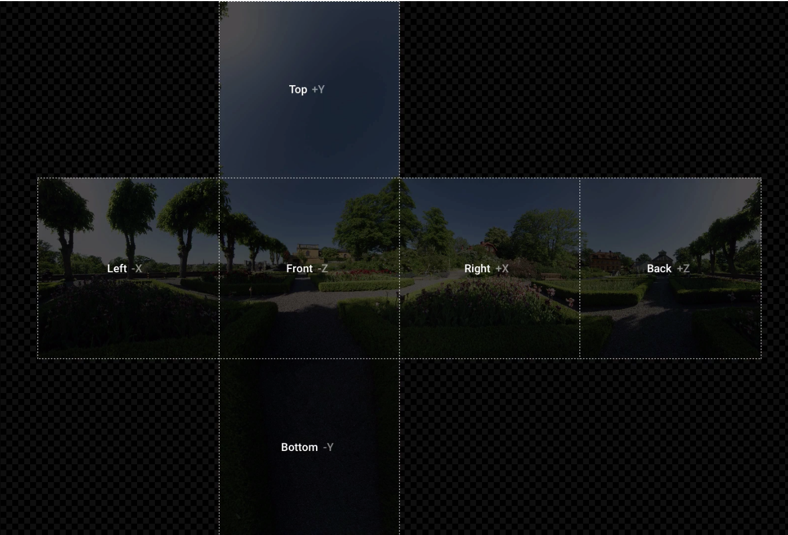

# IDEO SF VR Nerd Night in 3 Acts

## VR Prototyping x2 Approaches + VR Editorial & Effects Pipeline

### Overview

First, Burton will take us through a pair of methodologies for creating multi-device, web-based, Virtual Reality prototypes via the new WebVR API. Then, Dav will walk us through his preferred editorial and effects pipeline for crafting VR motion content.

***

### Act I: Prototyping VR with Framer Studio

#### Setup:

1. Download & install Framer Studio [here](http://framerjs.com/download/).
2. Download our sample VR project here [here](http://share.framerjs.com/hjdem7wtcq0n/) by clicking the down arrow in the top right of the page
3. Unzip the downloaded file and drag `ideo-framer-vr-nerd-night.framer` folder to the Framer Studio icon in either your dock or 'Applications' folder
4. Review code comments after each `#` to gain an understanding of the logic:

```
# import the VRComponent
{VRComponent, VRLayer} = require "VRComponent"

# using six images we create the cube map environment
vr = new VRComponent
	front: "images/front.jpg"
	right: "images/right.jpg"
	left: "images/left.jpg"
	back: "images/back.jpg"
	bottom: "images/bottom.jpg"
	top: "images/top.jpg"
	
# on window resize we make sure the vr component fills the entire screen
window.onresize = ->
	vr.size = Screen.size
```

** _**Btw, wtf is a 'cube map?'**_



#### Add an Icon:

The following code adds our `warning.svg` icon 15° to the right of our starting position and 6° up:

```
icon = new VRLayer
    image:"images/icons/warning.svg"
    heading: 15
    elevation: 6

vr.projectLayer(icon)
```

Detect which way the user is facing by adding the following lines:

```
vr.on Events.OrientationDidChange, (data) ->
    heading = data.heading # capture y axis rotation from 0-360°
    print data.heading # print heading to screen
```

#### Add Interactivity:

Turn on `click` events (off by default) by adding the following code (_note: this turns off click & drag navigation on desktop. Users can, however, navigate with the keyboard's arrow keys. Navigation behavior is not changed on mobile):

```
# enable click events (turns off click & drag to navigate on desktop)
vr.orientationLayer = false
```

Add a HTML text layer at the same heading as our icon (15°) and a slightly lower elevation (1.5°):

```
warningText = new VRLayer
	width: 215
	height: 50
	html: "<p style='font-size:22px; padding: 10px;'>Here's your warning</p>"
	backgroundColor: 'rgba(0, 0, 0, .65)'
	elevation: 1.5
	heading: 15
```

Add `` and `fadeIn` states to affect our `warningText` layer:

```
warningText.states.add
    fadeIn: {
    	opacity: 1
    }
    fadeOut: {
    	opacity: 0
    }
```

Add a `Click` event to our icon to control the `warningText` states:

```
icon.on Events.Click, ->
    if warningText.opacity == 1
    	warningText.states.switch("fadeOut")
    else
    	warningText.states.switch("fadeIn")
```

Finally, make our `warningText` invisible until it is clicked by adding this line to its properties:

```
opacity: 0
```

And comment out our `print.data.heading` line by adding a `#`, like this:

```
# print data.heading
```

_Note: Framer prototypes can be immediately viewed on your movile device via [Frameless](https://itunes.apple.com/us/app/id933580264) for iOS and [Framer](https://play.google.com/store/apps/details?id=com.framerjs.android) for Android. Simply connect your mobile device and Mac to the same Wi-Fi network. Select your project, and preview your prototype in full-screen._

#### References:

* Framer.js Blog: '[Design for Virtual Reality](http://blog.framerjs.com/posts/design-virtual-reality.html)'
* [How to] [Create your own Environment Maps](https://aerotwist.com/tutorials/create-your-own-environment-maps/) (also called 'cube maps')
* [Framer Basics](http://framerjs.com/learn/basics/)
* [CoffeeScript Basics](http://framerjs.com/learn/coffeescript/)

***

### Act II: Crafting VR content via simple, HTML markup via A-Frame by Mozilla

#### Setup:

1. Download Sublime Text 3 Trial [here](http://www.sublimetext.com/3) (or simply use whichever your preferred code editor)
2. Download the project files we'll be workin from [here]() **<-- needs link**
3. Unzip the project files and drag the `ideo-aframe-vr-nerd-night` folder to the Sublime Text icon in either your dock or 'Applications' folder

In Sublime Text, double-click both the `index.html` and `index-final.html` files in the sidebar. A review of the existing code shows we've added a `meta` tag for iOS home screen apps and imported a pair of JavaScript files:

```
<!DOCTYPE html>
<html>
  <head>

    <meta charset="utf-8">
    <title>IDEO SF Panorama - Lookout</title>

    <!-- hide browser chrome if site is saved to home screen on iOS -->
    <meta name="apple-mobile-web-app-capable" content="yes">

    <script src="js/aframe.js"></script>
    <script src="js/aframe-no-click-look-controls.min.js"></script>

  </head>

  <body>

    

  </body>

</html>

```

Withing the two `body` tags, add the following lines to add our lookout image to the scene:

```
<a-scene>
  <!-- point a-sky element to spherical image -->
  <a-sky src="img/panos/lookout.jpg" rotation="0 0 0"></a-sky>
</a-scene><!-- /.a-scene -->
```

_Note: all of the markup for our VR scene will exist w/in the 2 `a-scene` tags._

Open `index.html` in your browser and click & drag to pan around the scene.

While VR created with A-frame is navigated on mobile by simply moving your device to 'look' around the scene, desktop browsers require that you click & drag to navigate. To create a more analogous user experience, we're going to implement the more intuitive 'no click look controls' from [Alex Kass](https://github.com/alexrkass/aframe-no-click-look-controls).

Paste the following code beneath our `<a-sky…` line to add these controls and a cursor:

```
<!-- camera & cursor -->
<a-entity camera no-click-look-controls="maxyaw:3.5; maxpitch:1.5">

  <a-entity cursor="fuse: true; maxDistance: 30; timeout: 1000"
            geometry="primitive: ring"
            position="0 0 -1"
            scale=".035 .035 .035"
            material="color: white; shader: flat">
  </a-entity>

</a-entity><!-- /.camera & cursor -->
```

Refresh your browser to see how our navigation has changed.

Re: fuse based cursors, from the A-frame docs:

>If the cursor is set to be fuse-based, the cursor will trigger a click if the user gazes at one entity for a set amount of time. Imagine a laser strapped to the user’s head, and the laser extends out into the scene. After the timeout, whatever entity the laser intersects first will be clicked.

Having two cursors visible — both the ring that denotes what the user is looking at, and the traditional cursor — is a confusing user experience. With this in mind, paste the following lines after the `<title>` tag to hide the mouse:

```
<style>
  body {
    cursor: none;
  }
</style>
```

All we've yet to add, visually, is a means to navigate to another area of IDEO SF. Add the following just _above_ the closing `</a-scene>` tag:

```
<!-- front desk sign -->
<a-entity id="front-desk"
          position="10 1.4 -4"
          rotation="0 -75 0"
          geometry="primitive: plane; height: 1; width: 3.48;"
          material="src: url(img/icons/front-desk.png) opacity: .5; transparent: true;">
</a-entity><!-- /.front desk sign -->
``` 

Now, all that remains is a few lines of Javascript to navigate to our `front-desk.html` file on click. Add the following code just above the closing `</body>` tag:

```
<script>

  document.querySelector('#front-desk').addEventListener('click', function () {
    console.log('click front desk');
    location.assign("front-desk.html");
  });

  document.querySelector('#front-desk').addEventListener('mouseleave', function () {
    console.log('leave front desk');
  });

</script>
```

That's it! I've already written the markup & JavaScript for the `front-desk.html` file so that you can navigate back & forth between rooms. The code for both pages is effectively identical, so it's easy to see how quickly a number of VR scenes would be to create. With this in mind, there are a number of other spherical captures in the `img > panos` folder, should you wish to create and navigate to more rooms.

If you open Chrome's console `View > Developer > Javascript Console` or `⌥⌘J`, you'll see our `click` and `mouseleave` events firing as you roll over & off the signs.

#### Bonus:

For a better user experience for your VR prototypes on iOS, you can upload them to the web and save the page to the home screen of your phone to view them fullscreen, with no browser chrome (this effect is achieved via the `<meta>` tag toward the top of our pages). However, clicking links to other web pages in home screen web apps launches Mobile Safari to open the new page.

This is, of course, a miserable user experience. To resolve this and ensure that the pages are instead opened in your home screen web app, add the following JavaScript just before the closing `</script>` tag:

```
// open new pages in home screen web app on iOS, not in mobile safari
(function(a,b,c){if(c in b&&b[c]){var d,e=a.location,f=/^(a|html)$/i;a.addEvent Listener("click",function(a){d=a.target;while(!f.test(d.nodeName))d=d.parentNode;"href"in d&&(d.href.indexOf("http")||~d.href.indexOf(e.host))&&(a.preventDefault(),e.href=d.href)},!1)}})(document,window.navigator,"standalone")
```

#### References:

* [Mozilla A-Frame Site](https://aframe.io/) (Examples, Docs, Blog)
* [A-Frame on Github](https://github.com/aframevr/aframe/)
* [Made with A-Frame Tumblr](http://aframevr.tumblr.com/)
* [A-Frame Slack](https://aframevr-slack.herokuapp.com/)
* [WebVR Slack](https://webvr-slack.herokuapp.com/)
* [WebVR on Reddit](https://www.reddit.com/r/webvr)
* [No click look controls by Alex Kass](https://github.com/alexrkass/aframe-no-click-look-controls)

### Act III: VR Editorial & Effects Pipeline w/ Dav Rauch

***

## Worth noting

As Dav's presence and shared expertise shows, Nerd Night is not at all about me. Rather, it's about our community of minds being more deliberate about sharing what we know, particularly when it comes to new technologies & methodologies we're excited about; those that help us all to become better designers and to do new & interesting project work.

I've already spoken with Paulo and Mel about hosting a Nerd Night workshop on Facebook's excellent [React](https://facebook.github.io/react/) framework. React comes in two flavors, original and [React Native](https://facebook.github.io/react-native/), the latter technology being a means through which everyone here w/ web dev chops can be leveraged to write native iOS & Android apps using JavaScript (the layout of React Native apps is even done in Flexbox).

If you have or happen upon something you'd like to share, let me know. A few of us have spoken about making this a monthly get-together, which means a dozen new opportunities each year that we become a crew of even badder already bad m'f'ers.

